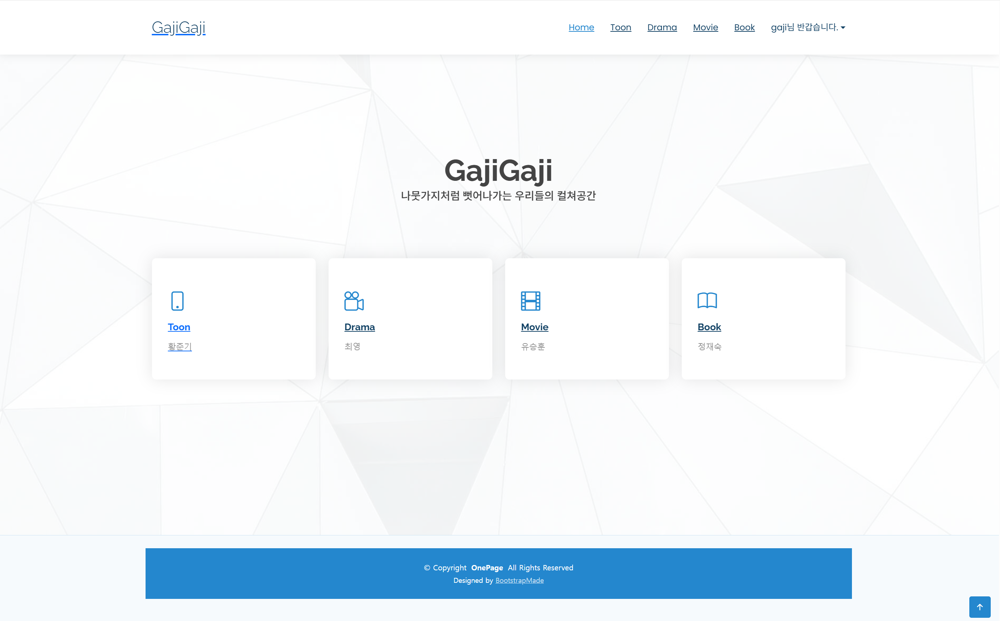

# 📚 가지가지 
다양한 문화 콘텐츠(웹툰, 영화, 책, 드라마)에 대한 리뷰를 공유하는 통합 플랫폼입니다.

---

## 📖 프로젝트 소개
**가지가지 리뷰**는 웹툰, 영화, 책, 드라마 등 다양한 장르의 리뷰를 한 곳에서 공유하고 소통할 수 있는 커뮤니티형 리뷰 플랫폼입니다.  
사용자들은 자유롭게 콘텐츠에 대한 의견을 나누고, 별점 및 하이라이트 이미지를 포함한 리뷰를 작성할 수 있습니다.

---

## ⏱ 개발 기간 및 인원
- **개발 기간**: 2025.08.08 ~ 2025.08.13
- **개발 인원**: 4명 (유승훈(조장), 정재숙, 최영, 황준기)

---

## 💡 개발 배경
- **문제점**: 여러 장르의 리뷰를 한 곳에서 볼 수 있는 플랫폼의 부재
- **해결책**: 다양한 장르의 리뷰를 통합하고, 사용자들이 자유롭게 소통할 수 있는 커뮤니티 구축

---

## ⚙ 주요 기능

### 1. 메인 페이지
- Toon, Drama, Movie, Book 각 장르별 메인 페이지로 이동하는 링크 표시
- 각 장르별 주요 콘텐츠로 바로 접근할 수 있는 기능 제공

### 2. 각 장르별 메인 페이지 (예: Toon, Drama, Movie, Book)
- 추천 콘텐츠 목록 표시
- 각 콘텐츠의 별점 및 장르 정보 표시
- 콘텐츠 제목, 줄거리 요약, 썸네일 이미지 표시
- 키워드 검색 기능
- 페이지네이션 기능 지원
  
  
### 3. 콘텐츠 상세 페이지
- 콘텐츠의 상세 정보 표시 (줄거리, 평균 별점)
- 콘텐츠의 하이라이트 이미지 갤러리 제공
- 댓글 목록 표시
- 댓글 작성, 수정, 삭제 기능 제공
- 추천 콘텐츠 목록 표시

### 4. CRUD 기능
- **게시글**: 리뷰 작성, 수정, 삭제
- **댓글**: 댓글 작성, 수정, 삭제

---

## 🛠 기술 스택

**백엔드**
- Python  
- Django

**프론트엔드**
- HTML  
- CSS  
- JavaScript  
- Bootstrap

**데이터베이스**
- SQLite

---

## 📌 향후 개선점
- **추천 시스템**: 사용자별 맞춤 콘텐츠 추천 알고리즘 도입
- **소통 기능**: 실시간 채팅 기능 도입

---

## 🎥 프로젝트 시연영상

---

## 📷 프로젝트 스크린샷

### 1. 메인 페이지  
홈페이지 첫 화면으로, 각 장르별 섹션으로 이동할 수 있습니다.

---

### 2. 장르별 메인 페이지

#### 드라마  
드라마 작품 목록과 썸네일, 간단한 정보가 표시됩니다.

#### 영화  
영화 목록과 검색, 리뷰 작성 기능을 포함하고 있습니다.

#### 책  
책 목록과 썸네일, 작품 정보가 표시됩니다.

#### 웹툰  
웹툰 목록과 검색, 리뷰 작성 기능이 포함되어 있습니다.

---

### 3. 상세 페이지

#### 드라마 상세 페이지  
작품 상세 설명, 하이라이트 이미지, 댓글 작성 기능 등이 있습니다.

#### 영화 상세 페이지  
작품 상세 설명과 하이라이트 이미지, 댓글 기능이 포함되어 있습니다.

#### 책 상세 페이지  
작품 상세 정보와 하이라이트 이미지, 댓글 기능이 제공됩니다.

#### 웹툰 상세 페이지  
작품 설명, 하이라이트 이미지, 댓글 작성 기능 등이 있습니다.

